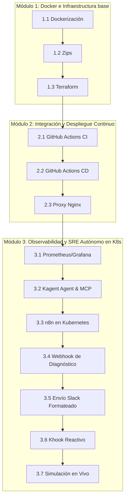

# Guía Didáctica y Secuencia de Prompts: DevOps & SRE Autónomo
## Manual del Profesor y Guía de Aprendizaje Incremental

Este documento está diseñado como una **guía de clase paso a paso**. Cada sección representa una lección incremental para que el profesor pueda explicar el concepto teórico, proporcionar el prompt exacto a los alumnos para ejecutar en su copiloto de IA, advertir sobre los puntos de falla comunes ("Dónde se rompe") y realizar la validación antes de pasar a la siguiente etapa.

---

## 🗺️ Mapa de la Clase y Dependencias



---

## 📦 MÓDULO 1: Dockerización e Infraestructura Cloud (Terraform)

### Paso 1.1: Dockerización de Frontend y Backend
* **Concepto Teórico:** Contenedores de compilación multi-etapa (multi-stage) para producción, reduciendo el tamaño final de la imagen y aislando dependencias de compilación.

#### 📝 Prompt para el Alumno
```text
Actúa como un DevOps Engineer. Necesito optimizar la dockerización de mi aplicación:
1. Escribe el Dockerfile para el Frontend (React/Vite). Debe usar Node 18, compilar el bundle estático para producción y exponerlo en el puerto 3000 usando un servidor web estático ligero.
2. Escribe el Dockerfile para el Backend (Node.js/Prisma). Debe usar Node 18, instalar dependencias de desarrollo, ejecutar obligatoriamente 'npx prisma generate' para compilar el cliente de Prisma, generar la compilación final y arrancar la aplicación exponiendo el puerto 8080.
Asegúrate de estructurar ambos Dockerfiles usando compilaciones multi-etapa para mantener el peso mínimo en producción.
```

#### ⚠️ Dónde se rompe (Gotchas)
> [!WARNING]
> **Error de Cliente Prisma:** Si los alumnos olvidan incluir `npx prisma generate` antes del build del backend, el contenedor se creará con éxito, pero fallará inmediatamente al primer intento de consulta de base de datos debido a que las clases cliente auto-generadas de Prisma no se encuentran en el paquete.

#### 🔍 Verificación y Práctica
1. Construir las imágenes locales: `docker build -t app-backend ./backend`.
2. Verificar que la imagen del backend contiene la carpeta generada del cliente Prisma.

---

### Paso 1.2: Automatización de Empaquetado (`generar-zip.sh`)
* **Concepto Teórico:** Preparación limpia de artefactos descargables eliminando directorios de desarrollo pesados (`node_modules`).

#### 📝 Prompt para el Alumno
```text
Escribe un script en Bash ('generar-zip.sh') para empaquetar mis aplicaciones de forma limpia antes de subirlas al repositorio de artefactos.
El script debe comprimir las carpetas 'frontend' y 'backend' en archivos individuales llamados 'frontend.zip' y 'backend.zip' en la raíz del proyecto.
Es crítico que el comando excluya las carpetas 'node_modules', '.git', '.github', archivos '.env' locales de configuración y carpetas temporales de compilación previa.
```

#### ⚠️ Dónde se rompe (Gotchas)
> [!IMPORTANT]
> **Saturación del Storage:** Si no se añaden las exclusiones correctas en el zip, las dependencias de node locales se empaquetarán en el archivo subido a AWS. Esto incrementará el tamaño del zip de 2MB a más de 300MB, provocando fallos por memoria o red en los pipelines y en la descarga por SSH en la máquina virtual EC2.

#### 🔍 Verificación y Práctica
1. Ejecutar `./generar-zip.sh`.
2. Verificar el tamaño de los zips creados en el explorador de archivos. No deberían superar unos pocos megabytes.

---

### Paso 1.3: Provisionamiento de Infraestructura con Terraform
* **Concepto Teórico:** Uso de Infraestructura como Código (IaC) para desplegar recursos en la nube de forma declarativa e inyectar perfiles de IAM en caliente en cómputos EC2.

#### 📝 Prompt para el Alumno
```text
Actúa como un Cloud Engineer. Necesito desplegar la infraestructura en AWS usando Terraform dentro de la carpeta 'tf/':
1. Declara dos instancias EC2 t2.micro, una para el backend y otra para el frontend.
2. No definas una AMI estática. Obtén dinámicamente la última versión de la imagen oficial de Ubuntu 22.04 LTS para la región configurada usando un bloque 'data "aws_ami"'.
3. Crea un bucket S3 privado donde residirán los archivos 'frontend.zip' y 'backend.zip'.
4. Configura una política de IAM, un rol IAM y un Instance Profile ('aws_iam_instance_profile') asociado para permitir a las instancias EC2 conectarse a S3 y descargar los zips sin necesidad de almacenar credenciales de AWS de forma local.
5. Declara Security Groups que permitan tráfico SSH (puerto 22), puerto 3000 para el frontend y puerto 8080 para el backend.
```

#### ⚠️ Dónde se rompe (Gotchas)
> [!CAUTION]
> **Hardcodeo de AMIs y falta de Instance Profile:**
> * Utilizar una AMI estática escrita a mano fallará si el alumno despliega en una región diferente (ej: `us-east-1` vs `eu-west-1`).
> * Si no se asocia el `instance_profile` a la instancia EC2, el código de despliegue no podrá descargar los zips de S3, generando un fallo silencioso en los scripts de inicialización.

#### 🔍 Verificación y Práctica
1. Ejecutar `terraform validate` y `terraform plan` dentro del directorio `tf/`.
2. Asegurarse de que el plan describe la creación del perfil de instancia y la asignación del rol de lectura a las máquinas virtuales.

---

## 🚀 MÓDULO 2: Integración y Despliegue Continuo (CI/CD)

### Paso 2.1: Pipeline de Integración Continua (GitHub Actions CI)
* **Concepto Teórico:** Validación continua de cambios mediante construcción automatizada, bases de datos efímeras de prueba y ejecución de pruebas funcionales y de integración.

#### 📝 Prompt para el Alumno
```text
Actúa como un Ingeniero de CI/CD. Crea un archivo de workflow de GitHub Actions en '.github/workflows/ci.yml' que se ejecute en eventos de pull request a 'main'.
Declara un job de 'build' que realice las siguientes acciones:
1. Instale dependencias del backend y frontend de forma aislada.
2. Ejecute pruebas de unidad del backend.
3. Realice la compilación ('npm run build') de ambos proyectos.
4. Inicialice una base de datos PostgreSQL local en el pipeline utilizando Docker Compose.
5. Ejecute las migraciones de Prisma en el backend.
6. Espera de manera explícita y mediante un script o comando de sondeo a que los puertos del backend, frontend y la base de datos estén respondiendo activamente antes de continuar.
7. Ejecute los tests de integración de Cypress de forma exitosa.
```

#### ⚠️ Dónde se rompe (Gotchas)
> [!WARNING]
> **Carrera de Arranque de Puertos:** Los alumnos suelen encadenar comandos como `docker-compose up -d && npm test` o `npx cypress run` sin un retardo. La base de datos y los servidores Node tardan unos segundos en levantar internamente sus sockets. Si los tests arrancan de inmediato, fallarán porque el puerto correspondiente aún no acepta conexiones de red.
> * *Solución:* Añadir un script shell de sondeo o usar `npx wait-on http://localhost:8080` antes de lanzar Cypress.

#### 🔍 Verificación y Práctica
1. Confirmar que el pipeline de GitHub Actions integra el paso de espera.
2. Hacer un commit en una rama secundaria y forzar el pull request para ver el flujo ejecutarse secuencialmente.

---

### Paso 2.2: Despliegue Continuo (CD) por SSH
* **Concepto Teórico:** Entrega automatizada de artefactos empaquetados en servidores de producción y la importancia de la ejecución asíncrona de procesos.

#### 📝 Prompt para el Alumno
```text
Añade un job de 'deploy' al workflow de GitHub Actions que se ejecute únicamente tras completar con éxito el build en la rama 'main':
1. Configura credenciales de AWS.
2. Sube los archivos zips de frontend y backend actualizados al bucket S3.
3. Conéctate vía SSH a las instancias EC2 correspondientes.
4. Detén ejecuciones anteriores de la aplicación, descarga el nuevo zip desde S3 y descomprímelo.
5. Instala las dependencias de producción.
6. Arranca la aplicación Node del backend en segundo plano (background) para evitar que bloquee la sesión SSH activa.
```

#### ⚠️ Dónde se rompe (Gotchas)
> [!IMPORTANT]
> **Bloqueo de SSH Indefinido:** Ejecutar la aplicación mediante `node server.js` o `npm start` directamente desde la sesión SSH de GitHub Actions causará que el pipeline se congele en ese paso para siempre, ya que el comando nunca termina.
> * *Solución:* Arrancar la aplicación usando un gestor de procesos como `pm2 start`, o lanzarlo redirigiendo la salida a un log y enviándolo a segundo plano mediante `nohup node server.js > app.log 2>&1 &`.

#### 🔍 Verificación y Práctica
1. Validar que la ejecución del CD finaliza correctamente con código de salida `0` en GitHub Actions.
2. Verificar en la consola EC2 remota que el proceso sigue corriendo de fondo (`ps aux | grep node`).

---

### Paso 2.3: Configuración de Nginx como Proxy Inverso
* **Concepto Teórico:** Aislar el servidor de aplicación Node de la exposición directa al público y centralizar el cifrado/enrutamiento en un servidor web consolidado en el puerto estándar (80).

#### 📝 Prompt para el Alumno
```text
Actúa como un Administrador de Sistemas. Necesito exponer mi aplicación web en producción en el puerto web estándar.
Modifica la configuración de Nginx en la instancia EC2 para que actúe como un proxy inverso:
1. Escuche peticiones en el puerto 80.
2. Reenvíe el tráfico entrante del frontend al puerto interno 3000 de Node.
3. Reenvíe el tráfico del endpoint API del backend al puerto interno 8080.
Proporciona el archivo de configuración del bloque 'server' y los comandos para reiniciar el servicio de forma limpia.
```

#### ⚠️ Dónde se rompe (Gotchas)
> [!CAUTION]
> **Conflicto de Puertos y Configuraciones por Defecto:**
> Si la configuración por defecto de Nginx en Ubuntu `/etc/nginx/sites-enabled/default` permanece activa y enlazada al puerto 80, cualquier configuración nueva agregada al puerto 80 causará una colisión de bind o será ignorada.
> * *Solución:* Eliminar el enlace simbólico por defecto (`rm /etc/nginx/sites-enabled/default`) antes de aplicar la nueva directiva de proxy inverso.

#### 🔍 Verificación y Práctica
1. Acceder a la IP pública de la instancia sin especificar puertos (ej: `http://<IP-EC2>`).
2. Validar que el sitio web carga correctamente y consume la API.

---

## 📊 MÓDULO 3: Observabilidad y SRE Autónomo (Kubernetes, n8n & Kagent)

### Paso 3.1: Despliegue de Observabilidad en Kubernetes (Prometheus y Grafana)
* **Concepto Teórico:** Monitoreo del estado del clúster mediante agentes de scraping y configuración declarativa de alertas basadas en síntomas de usuario.

#### 📝 Prompt para el Alumno
```text
Actúa como un Kubernetes DevOps Engineer. Necesito desplegar una pila de observabilidad básica dentro de mi clúster local.
Escribe un archivo de manifiestos YAML unificado ('k8s/observability.yaml') que declare:
1. Un ConfigMap de Prometheus que defina la configuración de scraping para obtener métricas del servicio 'backend' en el puerto 8080 cada 15 segundos. Incluye un bloque de reglas de alerta para detectar fallas críticas en la infraestructura, como pods caídos o reiniciándose, o errores HTTP del backend.
2. Un Deployment de Prometheus (1 réplica) que monte el ConfigMap y exponga el puerto 9090.
3. Un Service de tipo ClusterIP para Prometheus en el puerto 9090.
4. Un Deployment de Grafana (1 réplica) con la variable de entorno GF_SECURITY_ADMIN_PASSWORD establecida en 'admin'.
5. Un Service de tipo ClusterIP para Grafana en el puerto 3000.
```

#### ⚠️ Dónde se rompe (Gotchas)
> [!WARNING]
> **Selectores de Servicio Mapeados de Forma Incorrecta:** Prometheus buscará el servicio `backend` en el puerto 8080. Si el Service de Kubernetes de la aplicación tiene selectores de etiquetas erróneos, Prometheus registrará el objetivo como `0/0 endpoints` o reportará fallas de conexión.

#### 🔍 Verificación y Práctica
1. Aplicar manifiesto: `kubectl apply -f k8s/observability.yaml`.
2. Abrir la interfaz de Prometheus y validar que los targets estén en estado `UP`.

---

### Paso 3.2: Declarar la Inteligencia y MCP (Kagent ModelConfig & Agent SRE)
* **Concepto Teórico:** Registro de credenciales de IA e inyección de agentes reactivos integrados con servidores de herramientas de infraestructura (MCP).

#### 📝 Prompt para el Alumno
```text
Actúa como un AI Platform Engineer. Estoy configurando Kagent en Kubernetes para habilitar auto-remediación autónoma.
Escribe dos manifiestos YAML:
1. Un recurso 'ModelConfig' llamado 'default-model-config' en el namespace 'default' que configure la conexión al proveedor OpenAI, extrayendo la API Key del secreto de Kubernetes llamado 'openai-secret' bajo la clave 'OPENAI_API_KEY', y configurando el modelo 'gpt-4o-mini'.
2. Un recurso 'Agent' llamado 'sre-agent' de tipo 'Declarative' que haga referencia al 'default-model-config' anterior.
3. El agente debe definir un 'systemMessage' detallado que le indique actuar como un SRE Virtual. Debe resolver incidentes leyendo logs, describiendo recursos de Kubernetes, y aplicando parches en caliente.
4. Vincula la sección 'tools' en el bloque 'spec.declarative' para permitir específicamente el uso del RemoteMCPServer llamado 'kagent-tool-server' con las herramientas: 'k8s_get_resources', 'k8s_get_pod_logs', 'k8s_patch_resource', 'k8s_describe_resource'.
```

#### ⚠️ Dónde se rompe (Gotchas)
> [!CAUTION]
> **Nombre de Herramientas de MCP Inválidos:** Los esquemas de validación de Kagent y Kubernetes imponen una restricción estricta de caracteres en los campos de nombres (por lo general, máximo 64 caracteres alfanuméricos y guiones). Si una herramienta de MCP expuesta por el servidor tiene un nombre excesivamente largo (como `argo_verify_argo_rollouts_controller_install`), el recurso `Agent` lanzará un error de formato al aplicarse.
> * *Solución:* Mapear solo herramientas necesarias con nombres limpios y cortos.

#### 🔍 Verificación y Práctica
1. Validar que la API Key está guardada: `kubectl get secret openai-secret`.
2. Aplicar manifiestos y verificar que el agente se registra de forma correcta: `kubectl get agent sre-agent`.

---

### Paso 3.3: Despliegue de n8n con Acceso Administrativo
* **Concepto Teórico:** Instalación del orquestador visual permitiendo interacción y ejecución de comandos directos sobre la API del plano de control de Kubernetes.

#### 📝 Prompt para el Alumno
```text
Actúa como un Administrador de Clúster de Kubernetes. Necesito desplegar n8n dentro de mi clúster para orquestar la auto-remediación.
Escribe un manifiesto YAML ('k8s/n8n.yaml') que declare:
1. Un PersistentVolumeClaim ('n8n-pvc') de 1Gi para persistir el almacenamiento de base de datos de flujos de n8n.
2. Un ServiceAccount ('n8n-sa') en el namespace 'default'.
3. Un ClusterRoleBinding ('n8n-sa-admin-binding') que asocie el ServiceAccount con el rol del sistema 'cluster-admin' (de modo que n8n tenga privilegios completos para gestionar el clúster si se ejecutan comandos).
4. Un Deployment de n8n (1 réplica) con la imagen oficial 'docker.n8n.io/n8nio/n8n:latest'.
5. El contenedor debe ejecutar un comando de inicio en bash que descargue el binario de 'kubectl' de forma dinámica (usando wget) y lo instale en la ruta de PATH del contenedor ('/home/node/.local/bin/kubectl') antes de iniciar n8n.
6. Agrega variables de entorno: N8N_PORT="5678", N8N_BASIC_AUTH_ACTIVE="false", N8N_USER_MANAGEMENT_DISABLED="true", y NODE_FUNCTION_ALLOW_EXTERNAL="*".
7. Expón un Service de tipo ClusterIP en el puerto 5678.
```

#### ⚠️ Dónde se rompe (Gotchas)
> [!WARNING]
> **Falta de ServiceAccount asignada al Pod:** Si los alumnos configuran el ServiceAccount y el ClusterRoleBinding, pero olvidan escribir `serviceAccountName: n8n-sa` dentro de la especificación del pod del Deployment de n8n, el contenedor se levantará con el token por defecto del namespace, bloqueando cualquier ejecución interna de comandos de Kubernetes.

#### 🔍 Verificación y Práctica
1. Desplegar n8n: `kubectl apply -f k8s/n8n.yaml`.
2. Verificar que el pod de n8n puede ejecutar kubectl: `kubectl exec -it <n8n-pod-name> -- kubectl get pods`.

---

### Paso 3.4: n8n Workflow - Webhook de Entrada y Diagnóstico (Alerta -> SRE Agent)
* **Concepto Teórico:** Conectar sistemas de alertas externas con APIs conversacionales de agentes de IA usando el protocolo estándar JSON-RPC 2.0.

#### 📝 Prompt para el Alumno
```text
Actúa como un Experto en Integraciones con n8n. Necesito configurar el primer paso de mi workflow de diagnóstico en un archivo JSON ('n8n/diagnostico_workflow.json'):
1. Configura un Webhook Node llamado 'alerta prometheus' que escuche peticiones POST en el endpoint 'prometheus-alert'.
2. Conecta un HTTP Request Node llamado 'Disparar Agente SRE' con las siguientes opciones:
   - Método: POST
   - URL: http://kagent-controller:8083/api/a2a/default/sre-agent/
   - Formato de Body: JSON-RPC 2.0 estricto. La estructura debe ser exactamente la siguiente, enviando la alerta capturada al Agente SRE:
     ```json
     {
       "jsonrpc": "2.0",
       "method": "message/send",
       "id": "1",
       "params": {
         "message": {
           "role": "user",
           "parts": [
             {
               "kind": "text",
               "text": "Se ha recibido la alerta '{{ $json.body.alerts[0].labels.alertname || 'Alerta Desconocida' }}' para el pod '{{ $json.body.alerts[0].labels.pod }}' en el namespace '{{ $json.body.alerts[0].labels.namespace || 'default' }}'. Utiliza tus herramientas de Kubernetes para diagnosticar la causa raíz, ver los logs, modificar o parchar los recursos afectados según corresponda para solucionar el incidente, y reporta tu diagnóstico detallado."
             }
           ]
         }
       }
     }
     ```
```

#### ⚠️ Dónde se rompe (Gotchas)
> [!CAUTION]
> **Espacios en Webhooks (404 Not Found) e Incorrecto JSON-RPC:**
> * **Ruta del Webhook:** Si el nodo de webhook se nombra con espacios (ej. "alerta prometheus"), n8n expone el endpoint URL-decodificado. Para invocarlo externamente, Alertmanager o `curl` deben usar doble codificación de URL en los espacios (`alerta%2520prometheus`). Si se realiza una llamada simple (`alerta%20prometheus` o `alerta prometheus`), n8n fallará devolviendo un código HTTP `404 Not Found`.
> * **Estructura JSON-RPC:** La API del Agente SRE de Kagent valida rigurosamente los campos JSON-RPC 2.0. Si el alumno utiliza la propiedad `"type": "text"` en lugar de `"kind": "text"`, el controlador de Kagent rechazará la petición con un error de parsing o validación de parámetros.

#### 🔍 Verificación y Práctica
1. Importar el workflow en la interfaz web de n8n.
2. Hacer un curl de prueba forzando el doble encodeo del webhook:
   `curl -X POST http://localhost:5678/webhook/1/alerta%2520prometheus/prometheus-alert -d '{"alerts":[]}'`

---

### Paso 3.5: n8n Workflow - Envío Formateado a Slack
* **Concepto Teórico:** Serialización segura de salidas de modelos de lenguaje grandes (que contienen markdown, saltos de línea y comillas) al enviarlos a APIs de chat externas.

#### 📝 Prompt para el Alumno
```text
Actúa como un Integrador de Automatizaciones. Necesito añadir un nodo final a mi workflow de n8n para enviar la respuesta del Agente SRE a Slack:
1. Añade un HTTP Request Node para enviar un POST a mi webhook de Slack: https://hooks.slack.com/triggers/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
2. Configura el body para enviar la salida del Agente SRE, la cual se localiza en la ruta JSON '$json.result.artifacts[0].parts[0].text'.
3. Asegura el payload JSON del body de la petición HTTP contra caracteres especiales, comillas y saltos de línea (\n) del reporte del agente utilizando obligatoriamente la función de serialización nativa de JavaScript.
```

#### ⚠️ Dónde se rompe (Gotchas)
> [!IMPORTANT]
> **Estructura del Payload de Slack Invalida:** Las respuestas de texto de los agentes SRE contienen texto formateado con Markdown y saltos de línea nativos. Escribir un JSON plano como `{"text": "{{ $json.result.artifacts[0].parts[0].text }}"}` provocará un fallo de parseo JSON (`400 Bad Request` en Slack) porque los saltos de línea romperán la sintaxis.
> * *Solución:* Usar expresiones de evaluación javascript en el body de n8n:
>   `{{ JSON.stringify({ text: "🤖 *Kagent SRE Agent Automation:*\n\n" + $json.result.artifacts[0].parts[0].text }) }}`.

#### 🔍 Verificación y Práctica
1. Ejecutar el flujo completo de prueba en n8n de forma manual.
2. Verificar que llega el mensaje con formato correcto en Slack y no se interrumpe por caracteres extraños.

---

### Paso 3.6: Automatización Reactiva Nativa con Khook
* **Concepto Teórico:** Implementar un disparador autónomo a nivel de eventos de clúster minimizando la latencia de respuesta, integrando control de ciclos infinitos.

#### 📝 Prompt para el Alumno
```text
Actúa como un IA Platform Architect. Deseo que el agente SRE se dispare de forma nativa en Kubernetes tan pronto como detecte que un contenedor se ha reiniciado, sin requerir n8n ni Prometheus.
Escribe un manifiesto YAML para un recurso 'Hook' de la API 'kagent.dev/v1alpha2' llamado 'sre-remediation-hook' en el namespace 'default':
1. Escucha eventos 'pod-restart' en el namespace 'default'.
2. Invoca directamente al agente de IA 'sre-agent'.
3. Pásale un prompt en formato de plantilla Go ('{{.ResourceName}}' y '{{.Namespace}}') indicándole: "Se ha reiniciado el pod '{{.ResourceName}}' en el namespace '{{.Namespace}}'. Diagnostica la falla analizando logs y corrige el problema en caliente."
```

#### ⚠️ Dónde se rompe (Gotchas)
> [!CAUTION]
> **Bucle Infinito de Tokens (Token Leak Loop):** Si un pod entra en `CrashLoopBackOff` (por ejemplo, muere cada 5 segundos al arrancar) y Khook se activa por cada evento de reinicio de forma instantánea sin cooldown, el Agente de IA se ejecutará continuamente en paralelo de manera infinita. Esto consumirá miles de tokens y de dinero de la API Key en pocos minutos.
> * *Solución:* El profesor debe recalcar la importancia de habilitar y configurar políticas de cooldown y debouncing en el recurso Hook para ignorar eventos repetidos del mismo recurso en ventanas de tiempo cortas (ej: ignorar reinicios adicionales durante 5 minutos).

#### 🔍 Verificación y Práctica
1. Revisar los logs del controlador de Kagent para asegurar que el Hook se ha registrado.
2. Comprobar que reacciona a los eventos de los Pods en el clúster.

---

### Paso 3.7: Simulación en Vivo de Falla OOMKilled
* **Concepto Teórico:** Ingeniería del caos controlada. Inyección de fallas reales para verificar el comportamiento extremo a extremo de la solución.

#### 📝 Prompt para el Alumno
```text
Escribe un script en Bash llamado 'simular_errores.sh' para probar la auto-remediación:
1. Al ejecutar './simular_errores.sh oom', debe parchar el deployment del backend en Kubernetes asignándole límites extremadamente bajos de memoria (ej. '10Mi' de RAM) para forzar un fallo inmediato de OutOfMemory (OOMKilled) en el arranque del contenedor.
2. Al ejecutar './simular_errores.sh restaurar', debe restaurar los límites a su valor normal ('256Mi') para permitir el funcionamiento saludable del pod.
```

#### ⚠️ Dónde se rompe (Gotchas)
> [!WARNING]
> **Establecer Valores Absurdamente Bajos (1Mi):** Si asignas un límite de memoria demasiado bajo (como `1Mi`), Kubernetes no podrá levantar el hilo básico del kernel del pod y éste quedará en estado bloqueado o desprogramado, en lugar de arrancar Node y morir por OOM. Fijar el límite en `10Mi` asegura que Node intente arrancar y muera de inmediato por OOM, generando la traza de log real necesaria para el diagnóstico del Agente.

#### 🔍 Verificación y Práctica
1. Ejecutar `./simular_errores.sh oom`.
2. Validar en el terminal: `kubectl get pods` muestra el pod del backend en `CrashLoopBackOff` u `OOMKilled`.
3. Disparar el flujo y verificar que el Agente SRE detecta la falla de memoria de `10Mi` y la incrementa de manera autónoma hasta resolver el incidente, enviando el reporte a Slack.
