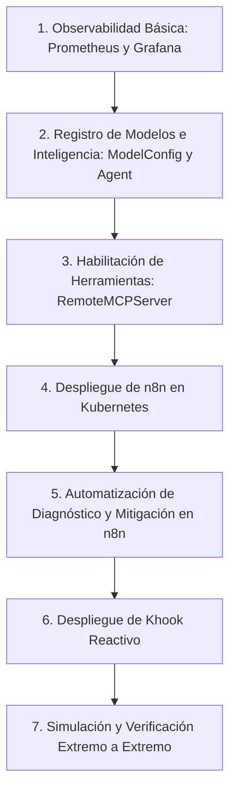

# Guía de Prompts: Observabilidad Inteligente y Auto-Remediación con Kubernetes, Kagent y n8n

Este archivo contiene los prompts estructurados que los alumnos y el profesor utilizarán durante la clase de Observabilidad y Remediacón en Kubernetes. Estos prompts están diseñados para ser ejecutados contra asistentes de IA (copilotos de codificación) para guiar la creación de recursos y automatizaciones extremo a extremo.

---

## 🗺️ Mapa Cronológico de la Clase


---

### Prompt 1: Despliegue de Prometheus y Grafana en Kubernetes
**Objetivo:** Crear un manifiesto de Kubernetes unificado para instalar Prometheus y Grafana de forma local.

```text
Actúa como un Administrador de Clúster de Kubernetes e Ingeniero DevOps. Necesito desplegar una pila de observabilidad básica dentro de mi clúster. 
Escribe un archivo de manifiestos YAML unificado (`k8s/observability.yaml`) que contenga:
1. Un ConfigMap de Prometheus que defina la configuración de scraping para obtener métricas del servicio `backend` en el puerto 8080 cada 15 segundos. Incluye también un archivo de reglas de alerta para latencia (`HighLatencyP99` > 500ms durante 1 min) y tasa de errores HTTP (`HighErrorRate` > 5% durante 30s).
2. Un Deployment de Prometheus (1 réplica) que monte el ConfigMap y exponga el puerto 9090.
3. Un Service de tipo ClusterIP para Prometheus en el puerto 9090.
4. Un Deployment de Grafana (1 réplica) con la variable de entorno `GF_SECURITY_ADMIN_PASSWORD` establecida en 'admin'.
5. Un Service de tipo ClusterIP para Grafana en el puerto 3000.
Usa las APIs recomendadas y las mejores prácticas de estructuración de manifiestos de Kubernetes.
```

---

### Prompt 2: Declarar la Inteligencia en el Clúster (Kagent ModelConfig y Agent SRE)
**Objetivo:** Registrar la configuración de modelo LLM y declarar el Agente SRE virtual dentro del clúster de Kubernetes.

```text
Actúa como un Ingeniero de Plataforma de IA. Estoy implementando Kagent en mi clúster de Kubernetes para habilitar auto-remediación autónoma.
Necesito que escribas dos manifiestos de Kubernetes en formato YAML:
1. Un recurso `ModelConfig` llamado `default-model-config` en el namespace `default` que configure una conexión a OpenAI (usando la API Key almacenada en el secret `openai-secret` bajo la clave `OPENAI_API_KEY`) y especifique el modelo `gpt-4o-mini`.
2. Un recurso `Agent` llamado `sre-agent` de tipo `Declarative` que utilice la referencia de `default-model-config` anterior. El agente debe definir en su bloque `spec.declarative` un `systemMessage` detallado que le indique actuar como un SRE Virtual del clúster de Kubernetes. Debe ser capaz de recibir alertas de Prometheus, diagnosticar problemas leyendo logs de los pods, e interactuar con el servidor MCP de Kagent (`kagent-tool-server`) utilizando herramientas para gestionar recursos de Kubernetes en caliente.
```

---

### Prompt 3: Consumir Herramientas del Servidor MCP en el Agente
**Objetivo:** Vincular la pila de herramientas de infraestructura del clúster con nuestro Agente SRE para que pueda interactuar con los recursos de Kubernetes.

```text
Actúa como un Diseñador de Agentes de IA en Kubernetes. Dispongo de un servidor MCP registrado en mi clúster como un RemoteMCPServer llamado `kagent-tool-server` que expone herramientas para gestionar Kubernetes (como `k8s_get_resources`, `k8s_get_pod_logs`, `k8s_patch_resource`, `k8s_describe_resource`).
Escribe la sección `tools` que debo añadir en el bloque `spec.declarative` de mi manifiesto YAML del recurso `Agent` para que el agente consuma específicamente estas herramientas. Asegúrate de estructurarlo correctamente indicando el `apiGroup`, `kind`, `name` del RemoteMCPServer y la lista de herramientas permitidas.
```

---

### Prompt 4: Despliegue de n8n en Kubernetes
**Objetivo:** Desplegar n8n de manera nativa dentro del clúster de Kubernetes, habilitando accesos administrativos para poder diagnosticar e invocar herramientas de línea de comandos.

```text
Actúa como un Administrador de Clúster de Kubernetes. Necesitamos instalar n8n en el clúster para orquestar los flujos de respuesta ante incidentes.
Escribe un manifiesto YAML (`k8s/n8n.yaml`) que declare:
1. Un PersistentVolumeClaim (`n8n-pvc`) de 1Gi para persistir el almacenamiento de base de datos SQLite y flujos de n8n.
2. Un ServiceAccount (`n8n-sa`) en el namespace `default`.
3. Un ClusterRoleBinding (`n8n-sa-admin-binding`) que asocie el ServiceAccount `n8n-sa` con el rol predefinido `cluster-admin` (para permitir la ejecución nativa de comandos kubectl desde dentro de los flujos de n8n si fuese necesario).
4. Un Deployment de n8n (1 réplica) con la imagen `docker.n8n.io/n8nio/n8n:latest`. El contenedor debe ejecutar un comando de inicio en bash que instale dinámicamente la herramienta `kubectl` (mediante wget a la URL oficial de descarga de Kubernetes) en `/home/node/.local/bin/kubectl` para que esté disponible en el PATH del contenedor.
5. El contenedor debe configurar las siguientes variables de entorno:
   - `N8N_PORT`: "5678" (para evitar conflictos de colisión de puertos inyectados).
   - `N8N_BASIC_AUTH_ACTIVE`: "false".
   - `N8N_USER_MANAGEMENT_DISABLED`: "true".
   - `NODE_FUNCTION_ALLOW_EXTERNAL`: "*" (para permitir funciones avanzadas de javascript).
6. Un Service de tipo ClusterIP que exponga el puerto 5678 del pod.
```

---

### Prompt 5: Ejercicio - Flujos de Automatización en n8n
**Objetivo:** Configurar las automatizaciones de respuesta en n8n que conecten las alertas del clúster con la API de Agentes SRE en formato A2A JSON-RPC 2.0 y notifiquen las acciones en Slack.

> [!IMPORTANT]
> Todos los flujos de n8n deben apuntar a la API A2A interna del clúster expuesta por el controlador: `http://kagent-controller:8083/api/a2a/default/sre-agent/` y utilizar la estructura oficial del protocolo JSON-RPC 2.0.

#### Prompt 5.1: Flujo 1 - Diagnóstico y Auto-Remediación Inteligente (Alerta -> SRE Agent -> Slack Webhook)
```text
Actúa como un Diseñador de Workflows de Automatización en n8n e Ingeniero DevOps. Necesito diseñar el primer flujo de trabajo en n8n para diagnosticar y auto-remediar automáticamente incidentes cuando se reciba una alerta de Prometheus.
Escribe el archivo JSON de configuración del flujo (`n8n/diagnostico_workflow.json`) que contenga los siguientes tres nodos encadenados:
1. Webhook Node: Escucha peticiones POST en el endpoint `prometheus-alert`. Recibirá la alerta JSON de Prometheus Alertmanager (ej. latencia alta o pod en CrashLoopBackOff).
2. HTTP Request Node ("Disparar Agente SRE"):
   - Método: POST
   - URL: http://kagent-controller:8083/api/a2a/default/sre-agent/
   - Body (JSON): Debe estructurar la llamada siguiendo el protocolo JSON-RPC 2.0 para interactuar con el agente en caliente:
     ```json
     {
       "jsonrpc": "2.0",
       "method": "message/send",
       "id": "1",
       "params": {
         "message": {
           "role": "user",
           "parts": [
             {
               "kind": "text",
               "text": "Se ha recibido la alerta '{{ $json.body.alerts[0].labels.alertname || 'Alerta Genérica' }}' en el clúster. Investiga el estado, lee los logs de los pods de backend en default, aplica la remediación correspondiente y reporta tu acción final."
             }
           ]
         }
       }
     }
     ```
3. HTTP Request Node ("Notificar Slack Webhook"):
   - Método: POST
   - URL: https://hooks.slack.com/triggers/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
   - Body (JSON): Debe enviar la respuesta generada por el agente SRE. Para evitar problemas de caracteres de escape y saltos de línea inválidos en el JSON final, utiliza la función `JSON.stringify` nativa de n8n:
     ```json
     {{ JSON.stringify({ text: "🤖 *Kagent SRE Agent Automation:*\n\n" + $json.result.artifacts[0].parts[0].text }) }}
     ```
```

#### Prompt 5.2: Flujo 2 - Acción de Remediación Interactiva (Slack Button Click -> SRE Agent -> Slack Update)
```text
Actúa como un Diseñador de Automatizaciones en n8n. Necesitamos configurar el segundo flujo de remediación interactiva, activado manualmente por un ingeniero desde Slack.
Escribe el archivo JSON de configuración del flujo (`n8n/remediacion_workflow.json`) que contenga los siguientes tres nodos:
1. Webhook Node: Escucha peticiones interactivos de Slack al hacer clic en el botón de confirmación de alerta.
2. HTTP Request Node ("Disparar Agente SRE"):
   - Método: POST
   - URL: http://kagent-controller:8083/api/a2a/default/sre-agent/
   - Body (JSON): Estructura la llamada JSON-RPC 2.0 solicitándole al agente SRE que ejecute las mitigaciones necesarias en caliente (como parches de escala o rollback) y verifique el restablecimiento de salud de la aplicación.
3. Slack Node ("Actualizar Alerta en Slack"):
   - Canal: #alertas-sre
   - Texto: Envía la traza recuperada del agente SRE mapeando el campo del resultado oficial:
     ```text
     ✅ *Incidente Resuelto (Auto-Remediado)*

     *Acción ejecutada por SRE Agent:*
     {{ $json.result.artifacts[0].parts[0].text || "El agente SRE ha ejecutado la remediación del servicio con éxito." }}
     ```
```

---

### Prompt 6: Configurar Khook para Auto-Remediación Reactiva Nativa
**Objetivo:** Crear un hook reactivo en Kubernetes que invoque al Agente SRE de forma directa ante reinicios de Pods sin pasar por herramientas de monitoreo externas.

```text
Actúa como un Ingeniero de Plataforma de IA. Estamos implementando Khook en nuestro clúster para hacer que nuestro agente sea reactivo ante eventos internos en tiempo real.
Escribe un manifiesto YAML para un recurso `Hook` de la API `kagent.dev/v1alpha2` llamado `sre-remediation-hook` en el namespace `default`.
Este Hook debe:
1. Escuchar los eventos de tipo `pod-restart` que ocurran en el namespace `default`.
2. Disparar automáticamente el agente de IA `sre-agent`.
3. Pasar al agente un prompt templado en Go que contenga la instrucción: "Se ha detectado un reinicio en el pod '{{.ResourceName}}' en el namespace '{{.Namespace}}'. Por favor, actúa como el SRE de guardia, investiga las causas de la falla leyendo los logs y la descripción del pod mediante tu servidor MCP de herramientas, y aplica una acción correctiva si procede. Reporta tus hallazgos."
Explica brevemente cómo Khook implementa el debouncing para evitar saturación de bucles infinitos en CrashLoopBackOff.
```

---

### Prompt 7: Simulación de Incidentes en el Clúster
**Objetivo:** Desarrollar un script en Bash para inyectar fallos (como límites insuficientes de memoria) y validar el comportamiento reactivo de nuestra pila SRE y de n8n.

```text
Escribe un script en Bash (`simular_errores.sh`) para inyectar fallos de forma automática en Kubernetes para nuestras simulaciones de clase:
1. OOM Killed: Configurar el deployment del backend con límites de memoria absurdamente bajos (ej. 10Mi) para forzar un reinicio por OutOfMemory inmediato que active la alerta y al SRE Agent.
2. ImagePullBackOff: Modificar el deployment de frontend para usar una versión de imagen inválida (ej. `local/frontend:invalid-tag-error`).
3. Scale Down: Reducir las réplicas del backend a 0 para simular una interrupción total.
4. Restaurar: Devolver todos los deployments a sus estados saludables originales usando los recursos base del clúster.
```

---

### Prompt 8: El Prompt Maestro (End-to-End DevSecOps - Pila Completa de Auto-Remediación en Kubernetes)
**Objetivo:** Disponer de un único prompt maestro estructurado cronológicamente que sirva para guiar a un asistente de IA a construir, configurar, desplegar y validar toda la infraestructura y lógica de auto-remediación en caliente.

```text
Actúa como un Arquitecto Principal de DevSecOps y SRE. Necesito implementar una solución de auto-remediación autónoma y reactiva en mi clúster de Kubernetes utilizando Prometheus, Grafana, Kagent (SRE Agent con MCP) y n8n.

Diseña y genera todos los recursos de configuración estructurados en la siguiente secuencia cronológica exacta:

1. OBSERVABILIDAD BÁSICA (k8s/observability.yaml):
   - ConfigMap de Prometheus con scraping de 'backend:8080' cada 15s y reglas de alerta para HighLatencyP99 (>500ms durante 1m) e HighErrorRate (>5% durante 30s).
   - Deployment y Service para Prometheus (puerto 9090).
   - Deployment y Service para Grafana (puerto 3000, admin pass: 'admin').

2. INTELIGENCIA DE KAGENT (k8s/agent-sre.yaml & kagent-openai.yaml):
   - ModelConfig 'default-model-config' usando el proveedor OpenAI (cargando la API Key del secret 'openai-secret' en la clave 'OPENAI_API_KEY') y modelo 'gpt-4o-mini'.
   - Agent 'sre-agent' declarativo y systemMessage que le instruya a actuar como SRE virtual, analizar alertas, leer logs y parches.
   - Vincula la sección 'tools' en el agente para usar el RemoteMCPServer 'kagent-tool-server' con las herramientas: k8s_get_resources, k8s_get_pod_logs, k8s_patch_resource, k8s_describe_resource.

3. DESPLIEGUE DE N8N EN K8S (k8s/n8n.yaml):
   - PVC 'n8n-pvc' (1Gi).
   - ServiceAccount 'n8n-sa' y ClusterRoleBinding 'n8n-sa-admin-binding' mapeado a 'cluster-admin' para que n8n pueda ejecutar kubectl.
   - Deployment de n8n (imagen latest) con script en sh que descargue dinámicamente kubectl en el PATH, y defina las variables N8N_PORT: "5678", N8N_BASIC_AUTH_ACTIVE: "false", N8N_USER_MANAGEMENT_DISABLED: "true".
   - Service ClusterIP expuesto en el puerto 5678.

4. FLUJOS DE N8N (n8n/diagnostico_workflow.json & n8n/remediacion_workflow.json):
   - Flujo 1: Webhook en endpoint 'prometheus-alert'. Llama al SRE Agent en la URL interna 'http://kagent-controller:8083/api/a2a/default/sre-agent/' usando POST JSON-RPC 2.0 (method 'message/send', params con prompt del incidente). Envía la respuesta del agente a Slack usando JSON.stringify() sobre 'result.artifacts[0].parts[0].text'.
   - Flujo 2: Webhook para interactividad de Slack. Llama al SRE Agent para ejecutar remediación interactiva y actualiza el mensaje de Slack a verde/resuelto con la salida del agente.
   - Nota de aprendizaje: Si el nodo Webhook tiene espacios en su nombre (ej. 'Alerta Prometheus'), el router de n8n registrará el path con espacios URL-encoded. Para llamarlo exitosamente, se debe usar doble codificación en el trigger (ej. '/webhook/1/alerta%2520prometheus/prometheus-alert').

5. AUTOMATIZACIÓN REACTIVA NATIVA (k8s/remediation-hook.yaml):
   - Manifiesto YAML para un recurso 'Hook' de Khook ('kagent.dev/v1alpha2') llamado 'sre-remediation-hook' que escuche eventos 'pod-restart' en el namespace 'default' y dispare directamente el 'sre-agent' usando un prompt templado.

6. SIMULACIÓN Y VERIFICACIÓN (simular_errores.sh):
   - Script Bash para simular fallos: OOMKilled (configurando límites de memoria a 10Mi en el backend para inducir fallos repetidos), ImagePullBackOff, Scale a 0 y una opción de Restauración.

Proporciona todos los archivos de configuración y manifiestos comentados con las mejores prácticas y explicaciones del razonamiento de la arquitectura.
```

